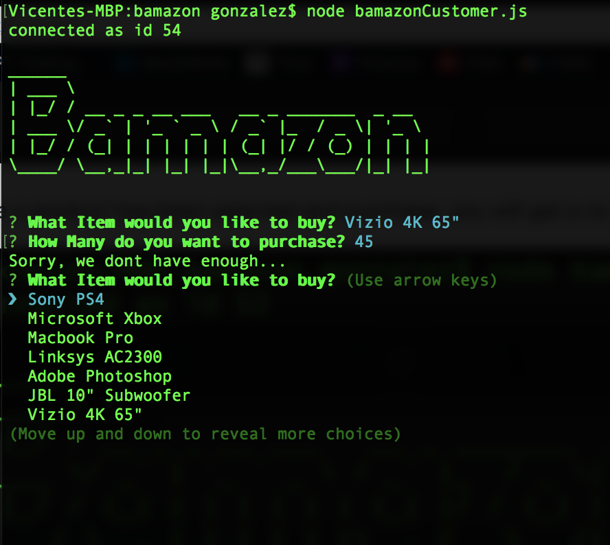

# bamazon
*SQL based database using MySQL and node.js*

## Dependencies included:
* mysql
* inquirer
* figlet(for fun)

Bamazon is a **CLI** (Command Line Interface) app that mimics a product search and inventory update, such as an online purchase. 

In Short, here are the steps taken to begin:

- initialize app using node *bamazonCustomer.js*
    
    

- Select a Product from which to purchase through a drop down inquirer:

    
- Choose how many you'd like to buy
    (*If there aren't enough, you will be prompted to choose another product*)

    

    

    

- Once a product has been selected and purchase, you will get a confirmation, and begin a new purchase!

   

